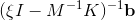
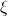

# resolvant-approx

Approximating  for several complex poles  and right hand sides **b**.

This project provides a matlab function ```resolvantApprox(K, M, b, xis, tols, cheb_max_order)``` and its dependencies that allows approximating the solutions to complex-shifted linear systems with Chebyshev approximation. Each system solution is approximated up to a specified tolerance error.

## Installing

Simply launch the ```compile.m``` matlab file, which should compile the ```./src/chebyProj.cpp``` file into a ```./chebyProj.*``` matlab routine.

## How to use it
Here is an example for 3 complex poles and a uniform tolerance of *10<sup>-9<sup>*, a discretized Laplacian operator, and one vector right hand side **b**.

``` matlab
J = 15; h = 2/J;
K = 0.02*gallery('poisson',J-1)/h^2;            % *negative* 2D Laplacian (positive spectrum)
n = length(K);
M = 3*speye(n, n);                              % symmetric definite positive matrix

b = rand(n, 1); b = b/norm(b);                  % normalized right hand side
xis = [ -9.5-2.0i, -11.7+0.5i, -8.7+0.1i];      % 3 poles
tols = ones(length(xis), 1) * 1e-9;             % uniform 1e-9 tolerance
cheb_max_order = 25;                            % maximum chebyshev order

out = resolvantApprox(K, M, b, xis, tols, cheb_max_order);
```

## How it works
The method used for constructing the approximation along with an API reference *will be* detailed in ```approximantConstruction.pdf```.
